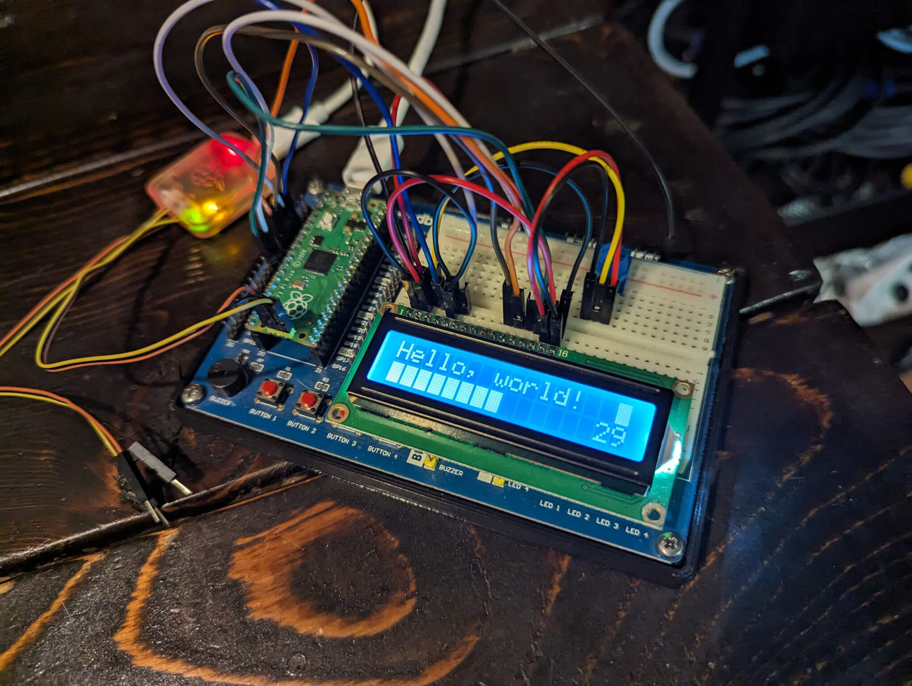

# pico-character-lcd
Character LCD library for the Raspberry Pi Pico C/C++ SDK.



## Installation
Make sure that [Raspberry Pi Pico SDK](https://github.com/raspberrypi/pico-sdk) is installed correctly before following the instructions below.

### Example Compilation
Clone the library using `git clone https://github.com/dcooperdalrymple/pico-character-lcd` into a suitable location. Run the following commands to build the library example and ensure that your machine is capable of building this software.

````
cd pico-character-lcd/example
mkdir build && cd build
cmake ..
make
````

### Install Extension into Your Project
In order to add this library as an extension of your project, insert it as a submodule using `git submodule add https://github.com/dcooperdalrymple/pico-character-lcd.git` into the desired location. In the `CMakeLists.txt` file, insert `add_subdirectory(./{PATH_TO_SUBMODULE}/pico-character-lcd)` below your source files (ie: `add_executable(...)`). Then add `pico_character_lcd` to your list of _target_link_libraries_ such as `target_link_libraries(... pico_character_lcd ...)`.

## Usage
There are three Character LCD modes available, `CharacterLCD_4Bit`, `CharacterLCD_8Bit`, and `CharacterLCD_I2C` (untested). Once object is instantiated, calls to `.write(...)` update a local buffer. In order to push this buffer to the device, `.update(...)` must be called. This should improve performance with partial screen updates. Please note that this library is not optimized for multi-line text and is instead focused on menu-driven applications.

Here is a basic example of writing to the screen:

````
#include "character_lcd_4bit.hpp"
static CharacterLCD_4Bit lcd(16, 2, 2, 3, 4, 5, 6, 7);
int main() {
    lcd.clear();
    lcd.write("Hello, world!");
    lcd.update();
    return 0;
}
````

See `./example/pico-character-lcd-example.cpp` for full implementation.

## Citations

* [raspberrypi/pico-examples](https://github.com/raspberrypi/pico-examples/tree/main/i2c/lcd_1602_i2c/)
* [adafruit/Adafruit_CircuitPython_CharLCD](https://github.com/adafruit/Adafruit_CircuitPython_CharLCD/)
